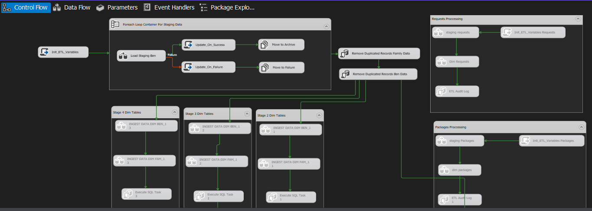

##  Overview

This project demonstrates a production-style **ETL pipeline built with SQL Server Integration Services (SSIS)**.
The pipeline ingests data from multiple Excel files, performs **data classification**, applies **Slowly Changing Dimension (SCD Type 2)** logic, and logs execution results into a tracking table.


---

##  Objectives

* Ingest multiple Excel files dynamically
* Support multiple sheets per file
* Apply business classification rules
* Implement **SCD Type 2** for historical tracking
* Capture **row-level metrics (insert/update)**
* Generate **execution summary logs**
* Enable monitoring and optional email notifications

---

##  Architecture Overview

###  Control Flow

```
[Initialize Variables]
        ↓
[Foreach Loop Container (Excel Files)]
        ├── Data Flow: Ingest Raw Data
        ├── Data Flow: Classification Logic
        ├── Data Flow: SCD Type 2 Processing
        ├── Script Tasks: Success/Failure Counters
        ↓
[Script Task: Build Summary + Log to DB]
        ↓
[Send Mail Task (Optional)]
```

---

##  Foreach Loop Design

### Enumerator:

* **Type:** Foreach File Enumerator
* **Pattern:** `*.xlsx`
* **Output Variable:** `FileName`

### Optional Enhancement:

* Nested loop for **multiple sheets per Excel file**

---

##  Data Flow Components

###  Ingestion Layer

* **Source:** Excel Source (dynamic file path & sheet name)
* **Transformations:** Data cleansing, type casting
* **Destination:** Staging tables (`STAG.*`)

---

###  Classification Layer

* Applies business rules using:

  * Derived Column
  * Conditional Split
* Outputs classified records for downstream processing

---

###  SCD Type 2 Layer

#### Logic:

* **Lookup Transformation**

  * Match on business key
* **Conditional Split**

  * New records → INSERT
  * Existing records → UPDATE (expire old + insert new version)

#### Implementation:

```
[Source]
   ↓
[Lookup (Business Key)]
   ↓
[Split]
   ├── New → Insert (Current = 1)
   └── Existing → Expire + Insert (SCD2)
```

#### Columns:

* `is_current`
* `start_date`
* `end_date`

---

##  Row Count Tracking

Row counts are captured using **Row Count transformations**:

| Metric        | Variable           |
| ------------- | ------------------ |
| Inserted Rows | `InsertedRowCount` |
| Updated Rows  | `UpdatedRowCount`  |

---

##  Execution Metrics

Tracked at package level:

| Variable            | Description                     |
| ------------------- | ------------------------------- |
| FilesProcessedCount | Successfully processed files    |
| FilesFailedCount    | Failed files                    |
| ETL_Status          | Completed / CompletedWithErrors |
| FilesSummary        | Detailed execution log          |

---

##  Logging Strategy

### Logging Table

```sql
CREATE TABLE ETL_LOG (
    RunID INT IDENTITY PRIMARY KEY,
    RunDate DATE,
    FilesProcessed INT,
    FilesFailed INT,
    Summary NVARCHAR(MAX),
    ETL_Status NVARCHAR(50)
);
```

---

### Logging Implementation

A **C# Script Task**:

* Builds execution summary
* Captures:

  * File-level results
  * Row counts
  * Status
* Inserts directly into `ETL_LOG`

---

##  Sample Summary Output

```
========== ETL Execution Summary ==========
Run Date: 2025-01-01
Files Processed: 5
Files Failed: 1
ETL Status: CompletedWithErrors
------------------------------------------
Pipeline Details:
 - New records inserted: 1200
 - Existing records updated: 340
==========================================
```

---

##  Notification (Optional)

* **Send Mail Task**
* Triggered after logging
* Sends summary using SMTP server
* Supports dynamic subject & body

---

##  Key Design Patterns

###  Dynamic File Handling

* Foreach Loop + variables
* No hardcoded file names

###  Reusable Data Flows

* Same pipeline applied to multiple inputs

###  SCD Type 2 Best Practice

* Historical tracking
* No data overwrite

###  Centralized Logging

* One record per ETL run
* Easy monitoring

###  Error Resilience

* Failure paths tracked
* ETL continues processing remaining files

---

##  Performance Considerations

* Use **Fast Load** for bulk inserts
* Avoid row-by-row updates → prefer staging + set-based SQL
* Use **Lookup Cache (Full Cache)**
* Minimize transformations inside loop when possible

---

##   Repository Structure

```
/ssis-project
  /packages
  /config
  /sql
    - staging_tables.sql
    - dim_tables.sql
    - etl_log.sql
  README.md
```

---

##  Conclusion

This project demonstrates:

* End-to-end ETL pipeline design
* Advanced SSIS patterns (looping, logging, SCD2)
* Clean separation of ingestion, transformation, and persistence layers
* Production-ready monitoring and observability

